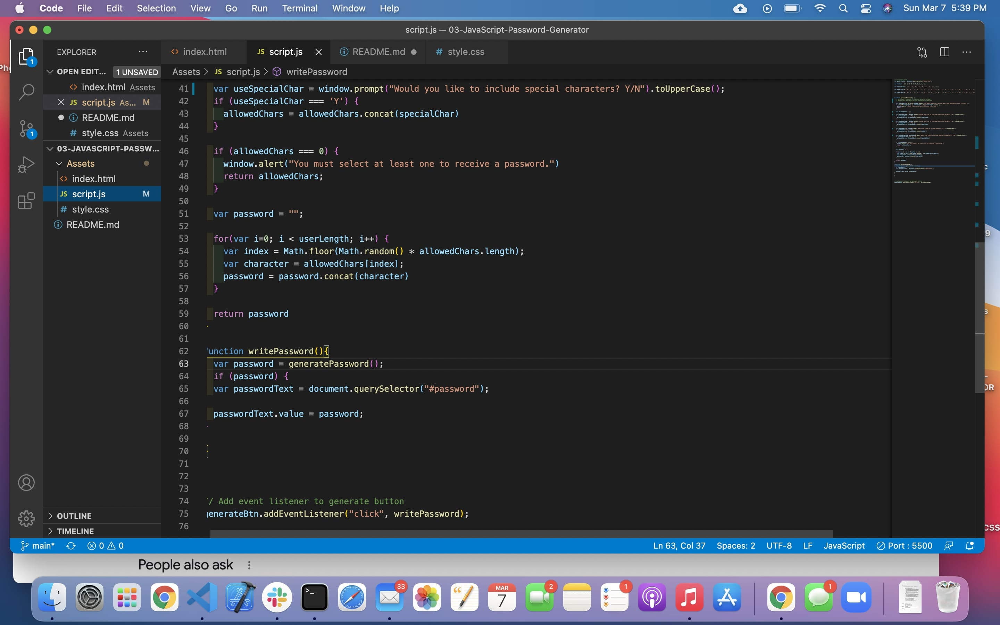

# 03-JavaScript-Password-Generator

# homework 3  3.07.21 Due date
## JavaScript developed for password generator:
* Global variables were set for special characters, numbers, lower and uppercase letters.
* Function used for window prompt selection of globel variables that are to be used for the password generator.
* Math.floor(Math.random() used to randomly select variables from the 4 global var.
* querySelector returns the password element.
* While there are several different ways to code this project, I chose the JS code used as it was a logical, easy to follow delivery.   

## Link to deployed website.

## Screenshots:
.jpg)

